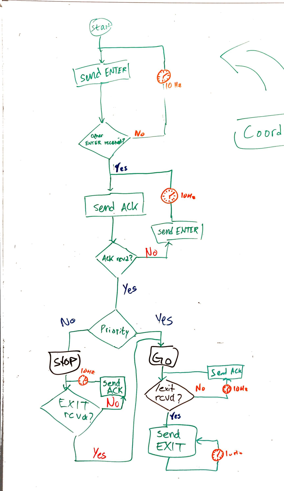

# Coordination node

This ROS node implements intersection arbitration for two bots and handles the UDP communication between the bots.
It starts a thread for handling incoming messages. The other thread executes the protocol. The threads in turn
communicate with shared variables (boolean flags). The logic for the different intersection scenarios are implemented
using abstract classes in Python and the Strategy design pattern.

The protocol is heavily inspired by a paper by Vladimir Savic (doi: 10.1109/IVS.2017.7995846). The main difference from
Vladimir's protocol is that we solve coordination for different priority signs instead of giving priority to whichever
car that will arrive first to the intersection. Also we only consider a four-way intersection with only one lane.

Below is a whiteboard sketch of our protocol:

