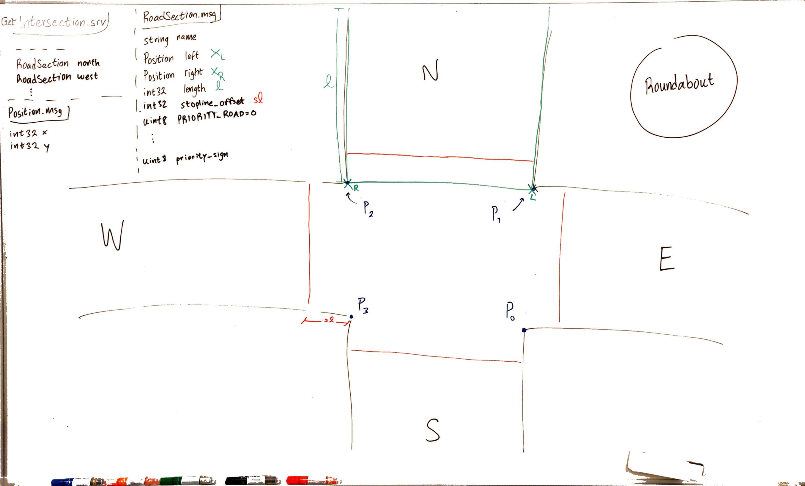

Map Data Node
==================

Modified code from the 2020 bachelor thesis
https://odr.chalmers.se/handle/20.500.12380/301963

Publishes an OccupancyGrid to the `/rviz_map` topic. This can be displayed in RViz or used by the navigation stack.

Example start:

    rosrun mapdata map_data_node.py _map_name:="eg5355"

Where eg5355 is the name of a folder in `./maps` that contains a config.yml file and a png of the map.

### Whiteboard sketch
How we modeled the intersection and message/service files:

