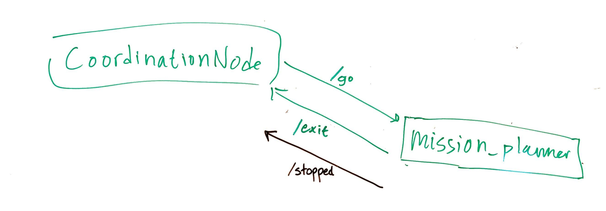
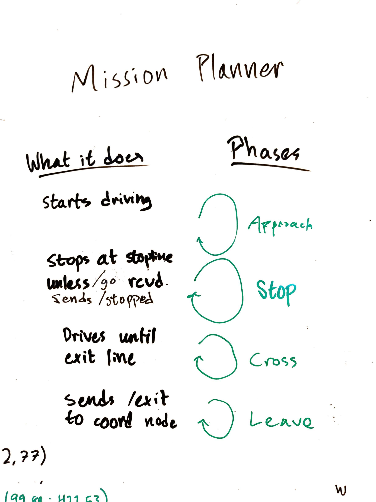

Mission Planner Node
====================

This node provides a framework for defining and executing missions.

For example, it can be used to implement missions for crossing four-way intersections with different priority signs.

# Parameters
The node takes the following global parameters:
- `~scenario`: The name of the scenario for which a mission should be loaded

# Topics
The node subscribes the following topics:
- `gv_positions`: To obtain live data about the current position of the robot

The node publishes the following topics:
- `cmd_vel`: To control robot movement in order to complete the mission

# Services
The node requires the following services:
- `intersection_data`: Provided by the `mapdata` node, this service provides details about the structure of the intersection (positions of roads, etc.)

### Whiteboard sketches
Communication on ROS topics with the coordination node

The different phases and an overview of what they do.
